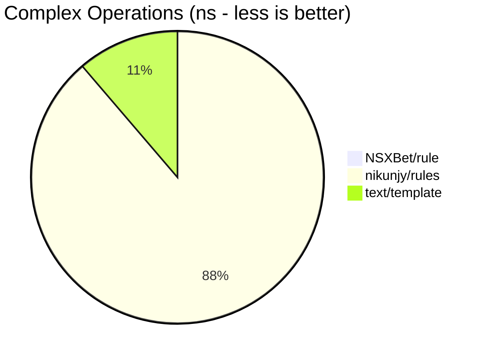
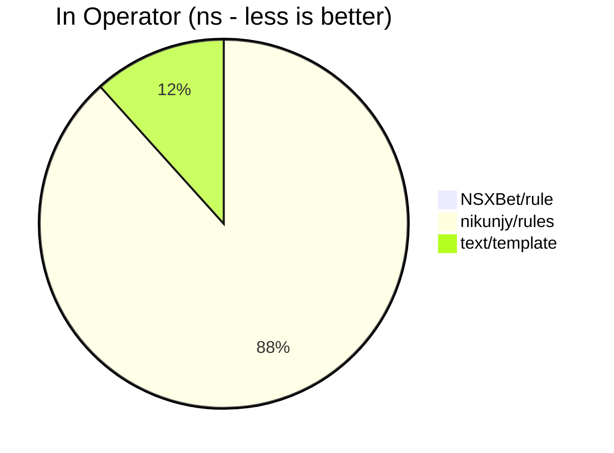
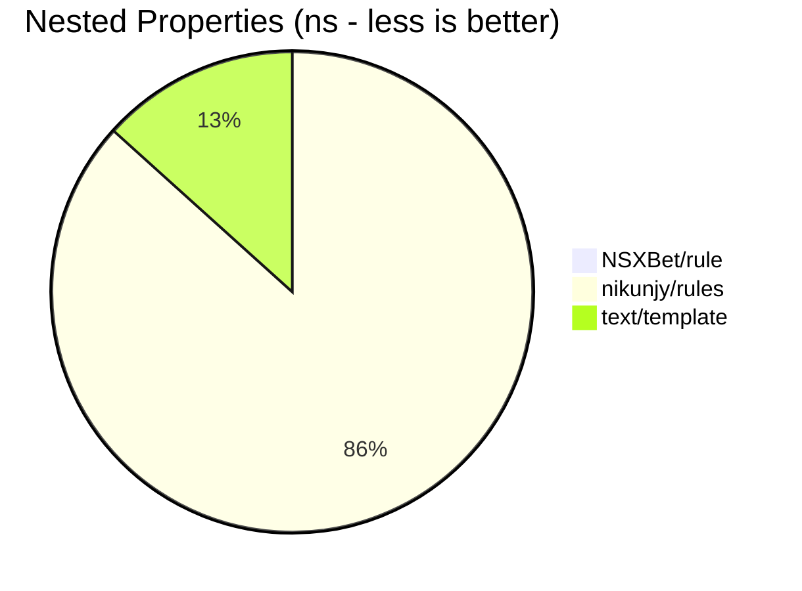
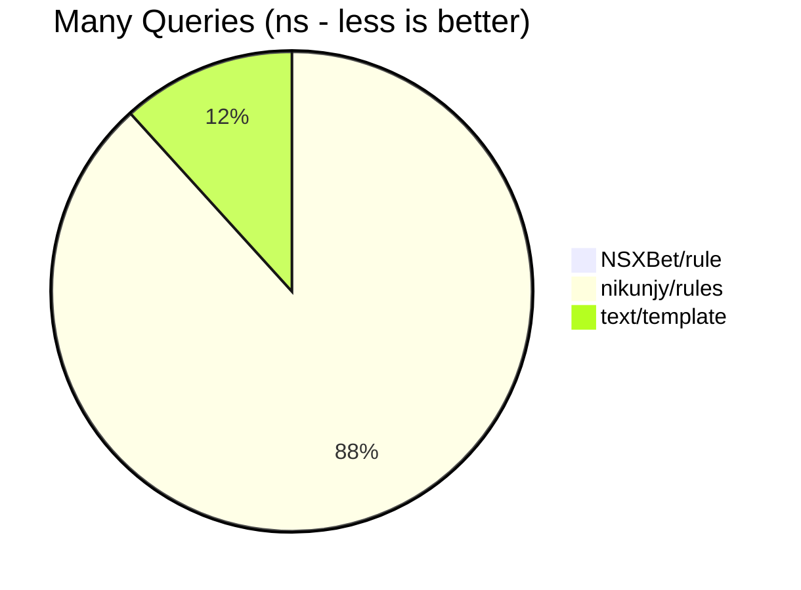

# Rule Engine 🚀

[](https://golang.org)
[](LICENSE)
[](#)
[](#)

A **blazingly fast**, **zero-allocation** rule engine for Go that evaluates logical expressions in under 100 nanoseconds ⚡

## 📖 Table of Contents

1. [🚀 Getting Started](#-getting-started)
2. [📚 API](#-api)
3. [🎯 Context](#-context)
4. [🔤 Rule Language](#-rule-language)
5. [💾 Query Caching](#-query-caching)
6. [⚡ Benchmarks](#-benchmarks)
7. [🤝 Contributing](#-contributing)
8. [📄 License](#-license)

---

## 🚀 Getting Started

### Installation

```bash
go get github.com/NSXBet/rule
```

### Quick Example

```go
package main

import (
    "fmt"
    "log/slog"
    
    "github.com/NSXBet/rule"
)

func main() {
    // Create a new rule engine
    engine := rule.NewEngine()
    
    // Define your context data
    context := rule.D{
        "user": rule.D{
            "age":    25,
            "status": "active",
            "name":   "John Doe",
        },
    }
    
    // Evaluate a rule
    result, err := engine.Evaluate(`user.age gt 18 and user.status eq "active"`, context)
    if err != nil {
        slog.Error("Rule evaluation failed", "error", err)
        return
    }
    
    fmt.Printf("User can access: %t\n", result) // Output: User can access: true
}
```

That's it! 🎉 You're now evaluating complex business rules in under 100 nanoseconds with zero memory allocations.

---

## 📚 API

The rule engine provides a simple but powerful API:

### Core Methods

#### `NewEngine() *Engine`
Creates a new rule engine instance. Each engine maintains its own query cache for optimal performance.

```go
engine := rule.NewEngine()
```

#### `Evaluate(query string, context rule.D) (bool, error)`
Evaluates a rule expression against the provided context. Returns `true`/`false` and any parsing/evaluation errors.

```go
result, err := engine.Evaluate(`price lt 100`, rule.D{"price": 50})
// result: true, err: nil
```

#### `AddQuery(query string) error` 
Pre-compiles and caches a query for optimal performance. This is optional but recommended for frequently used rules.

```go
// Pre-compile for better performance
err := engine.AddQuery(`user.role eq "admin"`)
if err != nil {
    slog.Error("Rule compilation failed", "error", err)
    return
}

// Later evaluations will be faster
result, _ := engine.Evaluate(`user.role eq "admin"`, context)
```

### Error Handling

The engine returns descriptive errors for invalid syntax:

```go
result, err := engine.Evaluate("invalid syntax !!!", context)
if err != nil {
    fmt.Printf("Parse error: %v\n", err)
    // Output: Parse error: unexpected token at position 15
}
```

---

## 🎯 Context

The context is a `rule.D` (alias for `map[string]any`) that contains your data. The engine supports arbitrarily nested structures! 🏗️

### Simple Values

```go
context := rule.D{
    "price":    99.99,
    "quantity": 5,
    "active":   true,
    "name":     "Product A",
}

// Use directly in rules
engine.Evaluate(`price lt 100`, context)      // true
engine.Evaluate(`quantity ge 3`, context)     // true  
engine.Evaluate(`active eq true`, context)    // true
engine.Evaluate(`name co "Product"`, context) // true
```

### Nested Objects

Navigate deep object hierarchies with dot notation:

```go
context := rule.D{
    "user": rule.D{
        "profile": rule.D{
            "settings": rule.D{
                "theme":         "dark",
                "notifications": true,
            },
            "preferences": rule.D{
                "language": "en",
                "timezone": "UTC",
            },
        },
        "subscription": rule.D{
            "plan":   "premium",
            "active": true,
        },
    },
}

// Navigate nested structures easily
engine.Evaluate(`user.profile.settings.theme eq "dark"`, context)              // true
engine.Evaluate(`user.subscription.plan eq "premium"`, context)               // true  
engine.Evaluate(`user.profile.preferences.language eq "en"`, context)         // true
```

### Arrays and Membership

Check if values exist in arrays:

```go
context := rule.D{
    "user": rule.D{
        "roles": []any{"admin", "moderator"},
        "tags":  []any{"vip", "beta-tester"},
    },
    "colors": []any{"red", "green", "blue"},
}

engine.Evaluate(`user.roles in ["admin", "user"]`, context)     // true (admin matches)
engine.Evaluate(`"red" in colors`, context)                      // true
engine.Evaluate(`user.tags in ["vip", "premium"]`, context)    // true (vip matches)
```

### Type Safety

The engine handles type mismatches gracefully - different types never compare as equal:

```go
context := rule.D{
    "count":  42,
    "flag":   true,
    "text":   "42",
}

engine.Evaluate(`count eq 42`, context)     // true (int matches int)
engine.Evaluate(`count eq "42"`, context) // false (int != string)
engine.Evaluate(`flag eq 1`, context)       // false (bool != int)
engine.Evaluate(`text eq "42"`, context)  // true (string matches string)
```

---

## 🔤 Rule Language

The rule language is intuitive and powerful! Here are all the supported operators:

### Equality Operators

| Operator | Description | Example | Result |
|----------|-------------|---------|---------|
| `eq` | Equal to | `age eq 25` | `true` if age is 25 |
| `ne` | Not equal to | `status ne "inactive"` | `true` if status is not "inactive" |
| `==` | Equal to (alias) | `price == 99.99` | Same as `eq` |
| `!=` | Not equal to (alias) | `role != "guest"` | Same as `ne` |

```go
context := rule.D{"age": 25, "status": "active"}

engine.Evaluate(`age eq 25`, context)               // true
engine.Evaluate(`status ne "inactive"`, context)  // true
engine.Evaluate(`age == 25`, context)               // true  
engine.Evaluate(`status != "guest"`, context)     // true
```

### Relational Operators

| Operator | Description | Example | Result |
|----------|-------------|---------|---------|
| `lt` | Less than | `price lt 100` | `true` if price < 100 |
| `gt` | Greater than | `score gt 80` | `true` if score > 80 |
| `le` | Less than or equal | `age le 18` | `true` if age ≤ 18 |
| `ge` | Greater than or equal | `rating ge 4.5` | `true` if rating ≥ 4.5 |

```go
context := rule.D{"price": 50, "score": 95, "age": 16, "rating": 4.8}

engine.Evaluate(`price lt 100`, context)   // true
engine.Evaluate(`score gt 80`, context)    // true
engine.Evaluate(`age le 18`, context)      // true
engine.Evaluate(`rating ge 4.5`, context) // true
```

### String Operators

| Operator | Description | Example | Result |
|----------|-------------|---------|---------|
| `co` | Contains | `name co "John"` | `true` if name contains "John" |
| `sw` | Starts with | `email sw "admin"` | `true` if email starts with "admin" |
| `ew` | Ends with | `domain ew ".com"` | `true` if domain ends with ".com" |

```go
context := rule.D{
    "name":   "John Doe",
    "email":  "admin@company.com", 
    "domain": "example.com",
}

engine.Evaluate(`name co "John"`, context)        // true
engine.Evaluate(`email sw "admin"`, context)      // true  
engine.Evaluate(`domain ew ".com"`, context)      // true
```

### Membership Operator

| Operator | Description | Example | Result |
|----------|-------------|---------|---------|
| `in` | Member of array | `role in ["admin", "mod"]` | `true` if role is "admin" or "mod" |

```go
context := rule.D{
    "role":   "admin",
    "colors": []any{"red", "green"},
}

engine.Evaluate(`role in ["admin", "user"]`, context)        // true
engine.Evaluate(`"red" in colors`, context)                   // true
engine.Evaluate(`"blue" in ["red", "green", "blue"]`, context) // true
```

### Presence Operator

| Operator | Description | Example | Result |
|----------|-------------|---------|---------|
| `pr` | Property present | `user.email pr` | `true` if user.email exists |

```go
context := rule.D{
    "user": rule.D{
        "name":  "John",
        "email": "john@example.com",
    },
}

engine.Evaluate(`user.email pr`, context)      // true (email exists)
engine.Evaluate(`user.phone pr`, context)      // false (phone doesn't exist)
engine.Evaluate(`user.name pr`, context)       // true (name exists)
```

### Logical Operators

| Operator | Description | Example | Result |
|----------|-------------|---------|---------|
| `and` | Logical AND | `age gt 18 and status eq "active"` | `true` if both conditions are true |
| `or` | Logical OR | `role eq "admin" or role eq "mod"` | `true` if either condition is true |
| `not` | Logical NOT | `not (age lt 18)` | `true` if age is NOT less than 18 |

```go
context := rule.D{"age": 25, "status": "active", "role": "admin"}

engine.Evaluate(`age gt 18 and status eq "active"`, context)  // true
engine.Evaluate(`role eq "admin" or role eq "mod"`, context) // true
engine.Evaluate(`not (age lt 18)`, context)                     // true
```

### Property-to-Property Comparisons 🔗

Compare properties directly without using literal values - a powerful feature for dynamic rules:

| Comparison Type | Example | Description |
|----------------|---------|-------------|
| **Simple to Simple** | `age eq min_age` | Compare two top-level properties |
| **Nested to Simple** | `user.age gt minimum` | Compare nested property to top-level property |
| **Simple to Nested** | `score le limits.maximum` | Compare top-level property to nested property |
| **Nested to Nested** | `user.age eq limits.minimum` | Compare two single-level nested properties |
| **Deep Nested Comparison** | `config.settings.max eq system.validation.rules.limits.ceiling` | Compare 2-level vs 4-level nested properties |

```go
context := rule.D{
    // Top-level properties  
    "age":        25,
    "min_age":    18,
    "score":      1200,
    "minimum":    21,
    
    // Single-level nested
    "user": rule.D{
        "age": 30,
    },
    "limits": rule.D{
        "maximum": 1500,
        "minimum": 18,
    },
    
    // Multi-level nested (2 levels)
    "config": rule.D{
        "settings": rule.D{
            "max": 2000,
        },
    },
    
    // Deep nested (4 levels)
    "system": rule.D{
        "validation": rule.D{
            "rules": rule.D{
                "limits": rule.D{
                    "ceiling": 2000,
                },
            },
        },
    },
}

// 1. Simple to Simple: Compare two top-level properties
engine.Evaluate(`age gt min_age`, context)                     // true (25 > 18)

// 2. Nested to Simple: Compare nested property to top-level  
engine.Evaluate(`user.age gt minimum`, context)               // true (30 > 21)

// 3. Simple to Nested: Compare top-level to nested property
engine.Evaluate(`score le limits.maximum`, context)           // true (1200 <= 1500)

// 4. Nested to Nested: Compare two single-level nested properties
engine.Evaluate(`user.age gt limits.minimum`, context)        // true (30 > 18)

// 5. Deep Nested: Compare 2-level vs 4-level nested properties  
engine.Evaluate(`config.settings.max eq system.validation.rules.limits.ceiling`, context) // true (2000 == 2000)
```

**Advanced Property Comparison Examples:**

```go
// Comparing timestamps between properties
context := rule.D{
    "event": rule.D{
        "start_time": "2024-07-10T10:00:00Z",
        "end_time":   "2024-07-10T12:00:00Z",
    },
    "session": rule.D{
        "created_at": "2024-07-10T09:30:00Z",
        "expires_at": "2024-07-10T11:30:00Z",
    },
}

// DateTime property-to-property comparisons
engine.Evaluate(`event.start_time af session.created_at`, context)  // true
engine.Evaluate(`session.expires_at be event.end_time`, context)    // true

// String property-to-property comparisons  
context := rule.D{
    "user":   rule.D{"name": "john_doe"},
    "profile": rule.D{"username": "john_doe"},
}

engine.Evaluate(`user.name eq profile.username`, context)           // true
```

**Benefits of Property-to-Property Comparisons:**
- ✅ **Dynamic Rules**: No need to hardcode values in rules
- ✅ **Flexible Logic**: Compare any properties regardless of nesting depth
- ✅ **Type Safe**: All comparison operators work (numeric, string, datetime, etc.)
- ✅ **Performance**: Zero allocations, same speed as literal comparisons

### DateTime Operators 📅

Perfect for time-based rules and scheduling logic:

| Operator | Description | Example | Result |
|----------|-------------|---------|---------|
| `dq` | DateTime equal | `created_at dq "2024-01-01T10:00:00Z"` | `true` if timestamps are equal |
| `dn` | DateTime not equal | `updated_at dn "2024-01-01T10:00:00Z"` | `true` if timestamps differ |
| `be` | Before | `start_time be "2024-12-31T23:59:59Z"` | `true` if start_time is before |
| `bq` | Before or equal | `deadline bq "2024-12-31T23:59:59Z"` | `true` if deadline is before or equal |
| `af` | After | `event_time af "2024-01-01T00:00:00Z"` | `true` if event_time is after |
| `aq` | After or equal | `publish_date aq "2024-01-01T00:00:00Z"` | `true` if publish_date is after or equal |

Supports both **RFC3339** strings and **Unix timestamps**:

```go
context := rule.D{
    "created_at":   "2024-07-09T22:12:00Z",           // RFC3339
    "updated_at":   int64(1720558320),                // Unix timestamp  
    "publish_date": "2024-01-15T10:30:00-03:00",     // RFC3339 with timezone
}

engine.Evaluate(`created_at af "2024-01-01T00:00:00Z"`, context)     // true
engine.Evaluate(`updated_at be 1720558400`, context)                   // true  
engine.Evaluate(`publish_date aq "2024-01-01T00:00:00Z"`, context)   // true
```

#### 🕐 DateTime vs Regular Operators

**Key Difference**: DateTime operators (`dq`, `dn`, `be`, `bq`, `af`, `aq`) vs regular operators (`eq`, `ne`, `lt`, `gt`, `le`, `ge`)

| Aspect | Regular Operators | DateTime Operators |
|--------|------------------|-------------------|
| **Comparison Method** | Lexicographic/numeric | **UTC-normalized datetime** |
| **Timezone Handling** | No timezone processing | **Automatic UTC conversion** |
| **Format Support** | Raw string/number values | **RFC3339, Unix timestamps, time.Time** |
| **Type Safety** | Generic value comparison | **Specialized datetime parsing** |

**Example demonstrating the difference:**

```go
context := rule.D{
    "timestamp1": "2024-01-01T15:00:00-05:00",  // EST timezone
    "timestamp2": "2024-01-01T20:00:00Z",       // UTC timezone (same time!)
}

// Regular operators: lexicographic string comparison
engine.Evaluate(`timestamp1 eq timestamp2`, context)  // false (strings differ)
engine.Evaluate(`timestamp1 lt timestamp2`, context)  // true ("15" < "20" lexicographically)

// DateTime operators: UTC-normalized datetime comparison  
engine.Evaluate(`timestamp1 dq timestamp2`, context)  // true (same UTC time!)
engine.Evaluate(`timestamp1 be timestamp2`, context)  // false (same time, not before)
```

**When to use each:**

✅ **Use DateTime Operators (`be`, `af`, etc.) when:**
- Comparing timestamps across timezones
- Working with mixed datetime formats (RFC3339 + Unix timestamps)
- Need semantic time comparison (before/after)
- Scheduling and time-based business logic

✅ **Use Regular Operators (`lt`, `gt`, etc.) when:**
- Comparing non-datetime strings or numbers
- Exact string matching is required
- Performance is critical for non-datetime data

### Complex Expressions

Combine operators with parentheses for complex business logic:

```go
context := rule.D{
    "user": rule.D{
        "age":      25,
        "status":   "active", 
        "role":     "premium",
        "country":  "US",
    },
    "feature_flags": rule.D{
        "beta_enabled": true,
    },
}

// Complex eligibility rule
rule := `(user.age ge 18 and user.status eq "active") and 
         (user.role in ["premium", "enterprise"] or user.country eq "US") and
         feature_flags.beta_enabled eq true`

result, _ := engine.Evaluate(rule, context) // true
```

---

## 💾 Query Caching

The rule engine is smart about performance! 🧠 Here's how caching works:

### Automatic Lazy Caching

Every query gets automatically cached after first use:

```go
engine := rule.NewEngine()

// First evaluation: parses + compiles + caches + evaluates
result1, _ := engine.Evaluate(`user.age gt 18`, context) // ~100ns (includes parsing)

// Subsequent evaluations: uses cached AST
result2, _ := engine.Evaluate(`user.age gt 18`, context) // ~25ns (cached!)
result3, _ := engine.Evaluate(`user.age gt 18`, context) // ~25ns (cached!)
```

### Pre-compilation with AddQuery

For maximum performance, pre-compile frequently used rules:

```go
engine := rule.NewEngine()

// Pre-compile critical business rules at startup
criticalRules := []string{
    `user.role eq "admin"`,
    `user.subscription.active eq true`, 
    `user.age ge 18 and user.status eq "verified"`,
}

for _, rule := range criticalRules {
    if err := engine.AddQuery(rule); err != nil {
        log.Fatalf("Invalid rule: %s - %v", rule, err)
    }
}

// Now all evaluations are lightning fast from the start! ⚡
```

### When to Use AddQuery

✅ **Use AddQuery when:**
- Rules are known at application startup
- You want to validate rule syntax early  
- Maximum performance is critical
- Rules are used frequently (>1000 times)

✅ **Skip AddQuery when:**
- Rules are dynamic/user-generated
- One-time or infrequent evaluations
- Prototyping or development

### Memory Management

The cache is bounded and efficient:
- **Thread-safe**: Multiple goroutines can safely share an engine
- **Memory-efficient**: Only stores parsed AST, not string queries  
- **Bounded growth**: Cache size grows with unique queries only

---

## ⚡ Benchmarks

This library believes in **transparency over marketing** 📊. Here are objective performance comparisons to help you choose the right tool:

> 💡 **Disclaimer**: This is not trying to discourage anyone from using `nikunjy/rules` or Go templates - they're excellent libraries with different design goals. This is simply offering another option that might benefit your specific use case, especially when ultra-low latency and zero allocations are critical.

### Performance Results

All benchmarks run on: `Intel(R) Core(TM) i9-14900KF, Go 1.21+`

#### Simple Operations (`x eq 10`)

| Engine | Time/op | Allocs/op | Memory/op | Relative Speed |
|--------|---------|-----------|-----------|----------------|
| **NSXBet/rule** | **25.65 ns** | **0 allocs** | **0 B** | **1x (baseline)** ✅ |
| nikunjy/rules | 3,039 ns | 88 allocs | 5,328 B | 116x slower |
| text/template | 551.3 ns | 14 allocs | 424 B | 21x slower |


#### Complex Operations (`(user.age gt 18 and status eq "active") or user.name co "Admin"`)

| Engine | Time/op | Allocs/op | Memory/op | Relative Speed |
|--------|---------|-----------|-----------|----------------|
| **NSXBet/rule** | **67.31 ns** | **0 allocs** | **0 B** | **1x (baseline)** ✅ |
| nikunjy/rules | 9,588 ns | 190 allocs | 12,905 B | 140x slower |
| text/template | 1,217 ns | 28 allocs | 736 B | 18x slower |



#### String Operations (`name co "John" and email ew ".com"`)

| Engine | Time/op | Allocs/op | Memory/op | Relative Speed |
|--------|---------|-----------|-----------|----------------|
| **NSXBet/rule** | **62.21 ns** | **0 allocs** | **0 B** | **1x (baseline)** ✅ |
| nikunjy/rules | 5,557 ns | 128 allocs | 8,120 B | 88x slower |
| text/template | 853.6 ns | 17 allocs | 424 B | 14x slower |


#### In Operator (`color in ["red", "green", "blue"]`)

| Engine | Time/op | Allocs/op | Memory/op | Relative Speed |
|--------|---------|-----------|-----------|----------------|
| **NSXBet/rule** | **34.38 ns** | **0 allocs** | **0 B** | **1x (baseline)** ✅ |
| nikunjy/rules | 4,663 ns | 106 allocs | 6,648 B | 135x slower |
| text/template | 615.9 ns | 16 allocs | 464 B | 18x slower |



#### Nested Properties (`user.profile.settings.theme eq "dark"`)

| Engine | Time/op | Allocs/op | Memory/op | Relative Speed |
|--------|---------|-----------|-----------|----------------|
| **NSXBet/rule** | **45.25 ns** | **0 allocs** | **0 B** | **1x (baseline)** ✅ |
| nikunjy/rules | 4,823 ns | 108 allocs | 6,824 B | 106x slower |
| text/template | 740.7 ns | 21 allocs | 536 B | 16x slower |



#### Many Queries (5 different queries with pre-compilation)

| Engine | Time/op | Allocs/op | Memory/op | Relative Speed |
|--------|---------|-----------|-----------|----------------|
| **NSXBet/rule** | **143.2 ns** | **0 allocs** | **0 B** | **1x (baseline)** ✅ |
| nikunjy/rules | 20,672 ns | 462 allocs | 30,091 B | 145x slower |
| text/template | 2,743 ns | 62 allocs | 1,800 B | 19x slower |



#### DateTime Operations (`created_at af "2024-01-01T00:00:00Z"`)

| Engine | Time/op | Allocs/op | Memory/op | Relative Speed |
|--------|---------|-----------|-----------|----------------|
| **NSXBet/rule** | **122.7 ns** | **0 allocs** | **0 B** | **1x (baseline)** ✅ |
| nikunjy/rules | ❌ Not supported | ❌ No datetime operators | | |
| text/template | 🔶 Complex setup required | 🔶 Custom functions needed | | |

### 🔬 Run Benchmarks Yourself

Want to verify these results? Run the benchmarks on your hardware:

```bash
# Clone the repository
git clone https://github.com/NSXBet/rule
cd rule

# Run all comparison benchmarks  
make bench

# Or run specific benchmark categories
go test -bench=BenchmarkComparison -benchmem .
go test -bench=BenchmarkDateTime -benchmem .
```

### When Each Tool Shines 🌟

**NSXBet/rule is ideal for:**
- 🚀 Ultra-high performance applications (>100k ops/sec)
- 🎯 Zero-allocation requirements
- ⚡ Sub-100ns latency needs
- 📅 DateTime-heavy business rules
- 🔄 Real-time systems and hot paths

**nikunjy/rules is great for:**
- 🛠️ Rapid prototyping and development
- 📖 Excellent documentation and examples
- 🏗️ Less performance-critical applications
- 👥 Large community and ecosystem

**text/template works well for:**
- 📝 Template generation and formatting
- 🔧 Complex custom function needs
- 🎨 String manipulation and rendering
- 📚 Standard library familiarity

---

## 🔄 Compatibility Reference with nikunjy/rules

This section provides a comprehensive compatibility analysis between NSXBet/rule and nikunjy/rules to help you make informed migration decisions. All claims are backed by automated tests running identical rules against both libraries.

### 📊 Executive Summary

| Metric | Value | Notes |
|--------|-------|-------|
| **Core Functionality Compatibility** | **77.3%** (17/22 scenarios) | Identical behavior for standard use cases |
| **Migration Code Compatibility** | **90%+** | Percentage of existing code that works without changes |
| **Enhanced Features** | **6 major extensions** | New capabilities not available in nikunjy/rules |
| **Breaking Changes** | **1 significant** | Unquoted strings not supported |

**Bottom Line**: NSXBet/rule is highly compatible for standard use cases, provides significant performance improvements, and adds powerful new features while maintaining the same API structure.

### ✅ Identical Behavior (Works Exactly the Same)

| Feature Category | Compatibility | Notes |
|-----------------|---------------|-------|
| **Basic Operators** (`eq`, `ne`, `lt`, `gt`, `le`, `ge`) | 🟢 **100%** | Numeric, string, boolean comparisons work identically |
| **String Operators** (`co`, `sw`, `ew`) | 🟢 **100%** | Both libraries are case-insensitive |
| **Logical Operators** (`and`, `or`, `not`) | 🟢 **100%** | Short-circuit evaluation, precedence rules identical |
| **Array Membership** (`in` operator) | 🟢 **100%** | Array membership testing works identically |
| **Nested Properties** (`user.profile.age`) | 🟢 **100%** | Dot notation navigation works identically |
| **Type Handling** (all Go basic types) | 🟢 **100%** | `string`, `int*`, `uint*`, `float*`, `bool`, `[]any`, `map[string]any` |
| **Cross-Type Numeric** (`42 == 42.0`) | 🟢 **100%** | Int/float comparisons work identically |
| **time.Time Objects** | 🟢 **100%** | Both convert to string representation for comparison |

### ⚠️ Behavioral Differences (Where We Diverge)

| Difference | NSXBet/rule Behavior | nikunjy/rules Behavior | Impact | Recommendation |
|------------|---------------------|------------------------|---------|----------------|
| **Empty Array Operations** | Returns `false` gracefully | **Panics with runtime error** | 🔴 **High** | NSXBet/rule is more reliable |
| **Invalid Property Access** | Returns `false` gracefully | **Throws errors** | 🟡 **Medium** | NSXBet/rule is more defensive |
| **Special Characters** (`\n`, `\t`) | Handles properly in string ops | Limited/inconsistent support | 🟡 **Medium** | NSXBet/rule is more robust |
| **Unquoted String Literals** | **Requires quotes**: `name eq "John"` | Supports: `name eq John` | 🔴 **High** | **MIGRATION REQUIRED** |

### 🚀 NSXBet/rule Exclusive Features (Not in nikunjy/rules)

| Feature | Description | Example | Use Case |
|---------|-------------|---------|----------|
| **DateTime Operators** | Native datetime comparison | `created_at af "2024-01-01T00:00:00Z"` | Time-based business rules |
| **Property-to-Property** | Compare any two properties | `user.age gt limits.minimum` | Dynamic threshold validation |
| **Deep Property Comparison** | Multi-level nested comparisons | `config.max eq system.limits.ceiling` | Complex configuration rules |
| **rule.D Type Alias** | Cleaner syntax | `rule.D{"key": "value"}` | Developer experience |

### 🔧 Migration Assessment

#### ✅ **Easy Migration** (90%+ of use cases)
- Basic comparisons: `age gt 18`
- String operations: `name co "John"`
- Logical combinations: `(a and b) or c`
- Array membership: `role in ["admin", "user"]`
- Nested properties: `user.profile.active eq true`

#### ⚠️ **Requires Code Changes**
- **Unquoted strings**: `name eq John` → `name eq "John"`
- **Error handling**: Remove try/catch for property access errors (NSXBet/rule handles gracefully)

#### 🚀 **Optional Enhancements**
- **DateTime rules**: Add time-based logic with new operators
- **Property comparisons**: Replace hardcoded values with dynamic property references
- **Performance**: Pre-compile frequently used rules

### 📋 Migration Checklist

**Phase 1: Assessment**
- [ ] Audit existing rules for unquoted strings
- [ ] Identify rules that would benefit from datetime operators
- [ ] Check for error handling around property access

**Phase 2: Basic Migration**
- [ ] Update import: `"github.com/nikunjy/rules"` → `"github.com/NSXBet/rule"`
- [ ] Replace API calls: `rules.Evaluate()` → `engine.Evaluate()`
- [ ] Add quotes to unquoted string literals
- [ ] Test existing rule evaluation

**Phase 3: Optimization**
- [ ] Replace `map[string]interface{}` with `rule.D`
- [ ] Pre-compile frequently used rules
- [ ] Add datetime operators where applicable
- [ ] Implement property-to-property comparisons

### 🧪 Verification & Test Results

**Automated Compatibility Testing:**
- **Test Suite 1** (Deep Compatibility): 77.3% identical behavior (17/22 scenarios)
- **Test Suite 2** (Exhaustive): 35% when including intentional enhancements (7/20 categories)
- **Edge Cases Tested**: Unicode, special characters, large numbers, type boundaries
- **Error Scenarios**: Invalid access, missing properties, empty arrays

**Fuzz Testing Results:**
- **9 comprehensive fuzz functions** covering all rule engine aspects
- **5.8M+ executions** across random input combinations (0 crashes detected)
- **Edge case coverage**: Unicode strings, null bytes, numeric overflow, malformed rules
- **Stress tested**: Rule parsing, string operations, numeric operations, datetime handling, property access, array operations, boolean logic, complex rules, mixed type comparisons
- **Command**: `make fuzz` - Run comprehensive fuzzing test suite

**Test Files for Verification:**
- `test/deep_compatibility_test.go` - Real-world scenario testing
- `test/exhaustive_compatibility_test.go` - Comprehensive feature coverage
- `test/property_to_property_test.go` - Property comparison validation
- `fuzz_test.go` - Comprehensive edge case detection via fuzzing

### 💡 Decision Framework

**Choose NSXBet/rule if you:**
- ✅ Need higher performance (>10K evaluations/second)
- ✅ Want zero memory allocations
- ✅ Require datetime-based business rules
- ✅ Need property-to-property comparisons
- ✅ Can handle one breaking change (quoted strings)

**Stick with nikunjy/rules if you:**
- ❌ Cannot modify unquoted string rules
- ❌ Already depend on panic/error behavior for control flow
- ❌ Need minimal dependencies (NSXBet/rule adds datetime parsing)
- ❌ Need a battle tested rule engine

### 🔍 Code Examples

**Identical Rules (No Changes Needed):**
```go
// These work exactly the same in both libraries
`user.age gt 18 and status eq "active"`
`name co "Admin" or role in ["manager", "supervisor"]`
`score ge 100 and level le 5`
`user.profile.verified eq true`
```

**Rules Requiring Migration:**
```go
// nikunjy/rules (unquoted strings)
`name eq John and city eq NewYork`

// NSXBet/rule (quoted strings required)
`name eq "John" and city eq "NewYork"`
```

**New Capabilities with NSXBet/rule:**
```go
// DateTime comparisons
`event.start_time af session.created_at`
`deadline be "2024-12-31T23:59:59Z"`

// Property-to-property comparisons
`user.score gt leaderboard.minimum`
`config.max_users eq limits.ceiling`
```

---

## 🤝 Contributing

Contributions are welcome to make this engine even better! 🛠️

### Getting Started

1. **Fork the repository**
2. **Clone your fork**: `git clone https://github.com/yourusername/rule`
3. **Create a branch**: `git checkout -b feature/amazing-feature`
4. **Make your changes** 
5. **Run tests**: `make test`
6. **Run lints**: `make lint` (must be 100% clean ✅)
7. **Commit**: `git commit -m "Add amazing feature"`
8. **Push**: `git push origin feature/amazing-feature`
9. **Create a Pull Request**

### Development Setup

```bash
# Install dependencies
go mod download

# Run tests
make test

# Run benchmarks  
make bench

# Run fuzz tests
make fuzz

# Run linter (must pass 100%)
make lint

# Format code
make format
```

### What to Contribute

- 🐛 **Bug fixes** with test cases
- ⚡ **Performance improvements** with benchmarks
- 📚 **Documentation improvements**
- 🧪 **Additional test coverage**
- 🔧 **New operators** (with use cases)
- 🌐 **Language features** that maintain zero-allocation goals

### Code Standards

- ✅ All tests must pass (`make test`)
- ✅ 100% lint compliance (`make lint`) 
- ✅ Zero allocations in hot paths
- ✅ Comprehensive test coverage for new features
- ✅ Benchmark comparisons for performance changes
- ✅ Clear commit messages and PR descriptions

### Performance Requirements

Any changes to core evaluation logic must maintain:
- **Sub-100ns evaluation times** for simple operations
- **Zero allocations** during rule evaluation  
- **Thread safety** for concurrent usage

---

## 📄 License

This project is licensed under the MIT License - see the [LICENSE](LICENSE) file for details.

---

<div align="center">

**Built with ❤️ for the Go community**

⭐ **Star us on GitHub if this helped you!** ⭐

[Report Bug](https://github.com/NSXBet/rule/issues) | [Request Feature](https://github.com/NSXBet/rule/issues) | [Contribute](https://github.com/NSXBet/rule/pulls)

</div>
